# ePaper Monitor AR

<p align="center">
  <picture>
    <source media="(prefers-color-scheme: dark)" srcset="docs/img/hero-dark.png">
    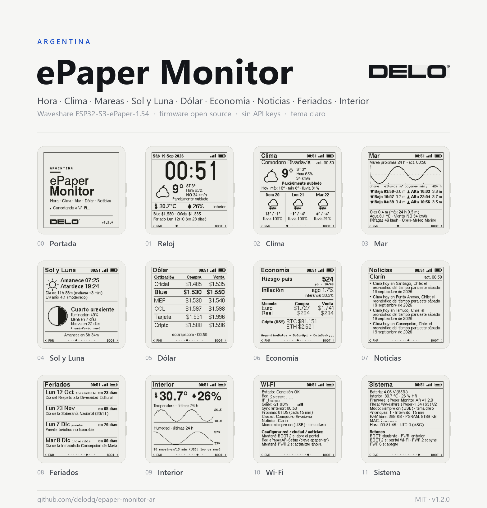
  </picture>
</p>

Firmware para la placa **Waveshare ESP32-S3-ePaper-1.54 (V2)**: un monitor de escritorio
argentino en tinta electrónica con **hora sincronizada por NTP (Argentina)**, **clima de tu
ciudad (ubicación automática)**, **mareas, olas y viento**, **sol y luna**, **dólar**,
**economía** (riesgo país, inflación, euro/real, BTC), **noticias**, **feriados** y
**temperatura/humedad interior con historial**. Navegación con los dos botones de la placa
al estilo M5StickC, portal Wi-Fi con QR y modo de bajo consumo para batería.

| Portada | Reloj | Clima | Mar |
|---|---|---|---|
| 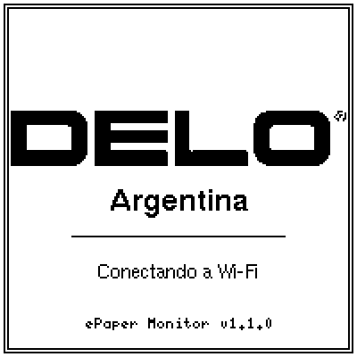 |  |  | 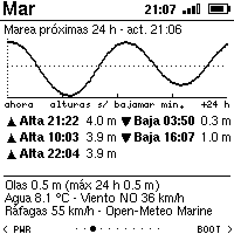 |

| Sol y Luna | Dólar | Economía | Noticias |
|---|---|---|---|
| 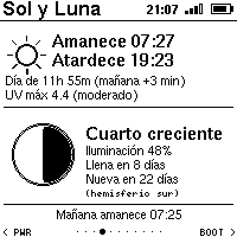 | 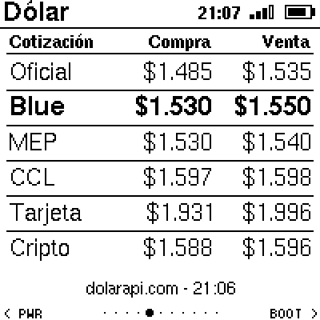 | 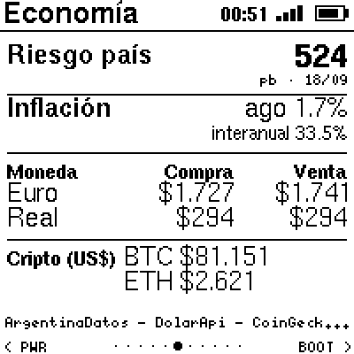 | 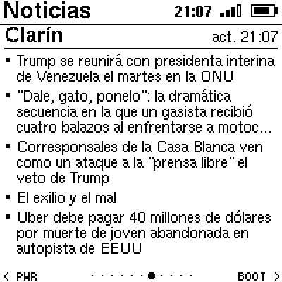 |

| Feriados | Interior | Wi-Fi | Sistema |
|---|---|---|---|
| 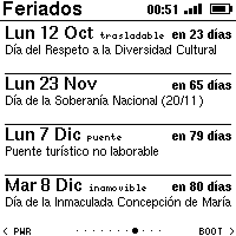 | 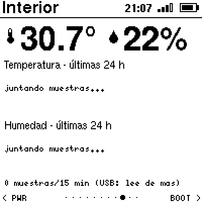 | 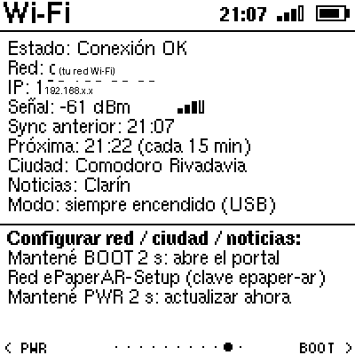 | 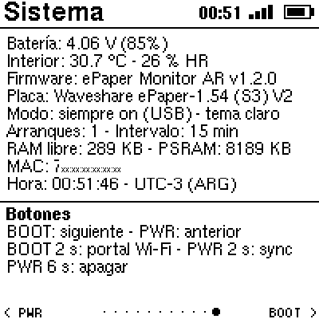 |

*(capturas reales tomadas del framebuffer de la placa con `tools/fbdump.py`; las versiones en
**modo oscuro** están en [`docs/img/dark/`](docs/img/dark/) y el hero de arriba cambia según el
tema de tu GitHub)*

Inspirado en [VolosR/waveshareEinkMonitor](https://github.com/VolosR/waveshareEinkMonitor)
(reloj + sensor SHTC3 con deep-sleep), reescrito desde cero con Wi-Fi, datos en línea,
11 secciones y navegación por botones.

---

## Características

- **Hora argentina** (UTC-3) sincronizada por NTP y guardada en el RTC PCF85063 de la placa:
  sigue en hora sin Wi-Fi y tras reinicios.
- **Ubicación automática**: al conectarse se geolocaliza por la IP pública de la red Wi-Fi
  (precisión a nivel ciudad). También se puede fijar una ciudad a mano.
- **Clima** actual + pronóstico de 3 días (Open-Meteo): temperatura, sensación térmica,
  humedad, viento con dirección y ráfagas, máx/mín, probabilidad de lluvia e íconos.
- **Mar** (Open-Meteo Marine): curva de marea de las próximas 24 h con pleamares y bajamares
  (hora y altura sobre la bajamar mínima), olas, temperatura del agua y viento. Busca sola la
  celda marina más cercana hacia el este (ideal para Comodoro y toda la costa atlántica).
- **Sol y Luna**: amanecer, atardecer, duración del día y cuánto cambia mañana, índice UV
  máximo, fase lunar dibujada (como se ve desde el hemisferio sur), iluminación y días hasta
  la luna llena/nueva.
- **Dólar** (dolarapi.com): oficial, blue, MEP, CCL, tarjeta y cripto, compra/venta.
- **Economía**: riesgo país e inflación mensual/interanual (argentinadatos.com), euro y real
  (dolarapi.com), BTC y ETH (CoinGecko).
- **Noticias**: titulares por RSS de Clarín, Ámbito, Perfil, BBC Mundo o La Nación
  (parser incremental: no carga el XML completo en RAM).
- **Feriados** argentinos (argentinadatos.com): los próximos 4 con cuenta regresiva y tipo
  (inamovible / trasladable / puente).
- **Interior**: temperatura y humedad del sensor SHTC3 integrado con gráfico de las últimas
  24 h (una muestra cada 15 min); **batería** con porcentaje.
- **Portal de configuración Wi-Fi** (WiFiManager) con **QR** en pantalla (red WPA2 con clave
  única por placa): red, ciudad, intervalo de actualización, fuente de noticias, tema y modo de
  energía. Sin credenciales en el código.
- **Seguro por defecto**: HTTPS con validación de certificados (bundle de CAs de Mozilla
  embebido), sin puertos abiertos ni OTA, descargas acotadas. Ver [`SECURITY.md`](SECURITY.md).
- **Bajo consumo medido y optimizado**: deep-sleep entre actualizaciones (~821 ms despierta
  por refresco de reloj), **perfiles de energía** (rendimiento / equilibrado / ahorro),
  **ahorro nocturno** y paso automático a ahorro con la batería baja. Cada dato se baja con
  la frecuencia con la que realmente cambia, y si no hay nada pendiente **la radio no se
  enciende** (sincronización en régimen: 0,31 s). Autonomía estimada ~43 días con 1000 mAh en
  el perfil equilibrado, contra ~18 días en v1.2.0 — ver [`docs/energia.md`](docs/energia.md).
  Con una PC conectada por USB queda "siempre encendido" automáticamente.
- **Tema claro u oscuro** (tinta negra sobre blanco o pantalla invertida), seleccionable en el
  portal o con el comando `t`; se recuerda entre reinicios.
- Tipografías con acentos (U8g2), íconos de clima dibujados por código, refresco parcial
  rápido y refresco completo periódico contra el ghosting.

## Hardware

| Componente | Detalle |
|---|---|
| Placa | Waveshare **ESP32-S3-ePaper-1.54 V2** (ESP32-S3-PICO-1-N8R8: 8 MB flash, 8 MB PSRAM octal) |
| Pantalla | 1.54" 200×200 B/N, controlador SSD1681 (GDEH0154D67) por SPI |
| RTC | NXP PCF85063A (I2C 0x51) |
| Sensor | Sensirion SHTC3 temperatura/humedad (I2C 0x70) |
| Botones | BOOT (GPIO0) y PWR (GPIO18), ambos despiertan del deep-sleep |
| Batería | Li-ion por conector JST; medición en GPIO4 (divisor ×2) |
| USB | USB-C con USB-Serial/JTAG nativo del ESP32-S3 (VID 303A / PID 1001) |

Mapa de pines completo en [`include/config.h`](include/config.h) y en
[`docs/hardware.md`](docs/hardware.md). La V1 de la placa (PSRAM quad) y la variante
*Touch* comparten los mismos pines; el firmware sólo fue probado en la V2.

## Botones (navegación estilo M5StickC)

| Acción | Efecto |
|---|---|
| **BOOT** corto | sección siguiente → |
| **PWR** corto | sección anterior ← |
| **BOOT** 2 s | abre el **portal Wi-Fi** (el LED se enciende al llegar a 2 s) |
| **PWR** 2 s | **sincronizar ahora** (hora, clima, dólar, noticias, feriados) |
| **PWR** 6 s | **apagar** (a batería corta la alimentación; con USB queda dormida hasta apretar PWR) |

Secciones, en orden: Reloj · Clima · Mar · Sol y Luna · Dólar · Economía · Noticias ·
Feriados · Interior · Wi-Fi · Sistema. Los puntos del pie de página indican la sección actual.

## Instalación

### Opción A — firmware precompilado

En [`firmware/`](firmware/) hay una imagen única (bootloader + particiones + aplicación) lista
para grabar en la dirección `0x0`. Con [esptool](https://docs.espressif.com/projects/esptool/)
instalado (`pip install esptool`):

```bash
esptool --chip esp32s3 --port COM4 --baud 460800 write-flash 0x0 firmware/epaper-monitor-ar-v1.3.0-merged.bin
```

(Reemplazá `COM4` por el puerto de tu placa. En Linux/macOS suele ser `/dev/ttyACM0`.)

### Opción B — compilar con PlatformIO

```bash
pio run -t upload          # compila y graba (puerto configurado en platformio.ini)
pio device monitor         # consola serie a 115200
```

Requiere PlatformIO con la plataforma `espressif32@6.13.0` (Arduino core 2.0.17); las
librerías (GxEPD2, U8g2_for_Adafruit_GFX, WiFiManager, ArduinoJson, QRCode) se instalan solas.

> Si la placa está en deep-sleep, el puerto COM sólo aparece ~1,5 s cada minuto. Para grabar:
> mantené **BOOT** 2 s (abre el portal y queda despierta 5 min) o conectala a la PC y
> reiniciala (con host USB detectado no duerme). Ver [`docs/desarrollo.md`](docs/desarrollo.md).

## Primer uso: configurar el Wi-Fi

1. Al encender sin red configurada, la pantalla muestra un **QR** y las instrucciones.
2. Escaneá el QR con el celular (o conectate a la red **`ePaperAR-Setup`** con la clave que
   muestra la pantalla, `epaper-xxxx`, única por placa) y abrí `http://192.168.4.1`.
3. Elegí tu red Wi-Fi, ingresá la clave y guardá. Opcionalmente ajustá:
   - **Ciudad**: `auto` (geolocalización por la conexión) o el nombre de una ciudad argentina.
   - **Intervalo** de actualización de datos: 5–120 min (por defecto 15).
   - **Noticias**: `clarin`, `ambito`, `perfil`, `bbc` o `lanacion`.
   - **Energía**: 0 = rendimiento (reloj cada minuto), 1 = equilibrado, 2 = ahorro.
   - **Ahorro nocturno**: de 00 a 07 h refresca y sincroniza mucho menos.
   - **Siempre encendido**: desactiva el deep-sleep aunque no haya PC conectada.
   - **Modo oscuro**: pantalla invertida (fondo negro, tinta blanca).
4. La placa sincroniza la hora, se geolocaliza y descarga todos los datos.

Para volver al portal en cualquier momento: **BOOT** 2 s. El portal se cierra solo a los 5 min.

## Modos de energía

| Situación | Comportamiento |
|---|---|
| **Batería** (o cargador sin PC) | Deep-sleep. Despierta para el reloj según el perfil (1 / 2 / 5 min, 10 min de noche) y sincroniza sólo cuando hay algo que bajar. Botones despiertan al instante. |
| **PC por USB** | Detecta el host (paquetes SOF) y queda **siempre encendido**: puerto serie disponible, botones por polling y Wi-Fi apagado entre sincronizaciones para calentar menos el sensor. Si se desconecta la PC (10 s sin SOF), pasa a deep-sleep solo. |
| **"Siempre encendido"** (portal) | Igual al modo USB, sin importar la alimentación. |

Nota: en modo siempre encendido el SHTC3 puede leer unos grados de más por el calor de la
propia placa; en deep-sleep la lectura es más fiel.

## Fuentes de datos (todas gratuitas, sin API key)

| Dato | Servicio |
|---|---|
| Hora | `ar.pool.ntp.org`, `south-america.pool.ntp.org`, `pool.ntp.org` |
| Ubicación (ciudad `auto`) | [ip-api.com](http://ip-api.com) (HTTP) con respaldo en [ipwho.is](https://ipwho.is) |
| Ciudad por nombre | [Open-Meteo Geocoding](https://open-meteo.com/en/docs/geocoding-api) |
| Clima, sol y UV | [Open-Meteo Forecast](https://open-meteo.com/) |
| Mareas, olas, agua | [Open-Meteo Marine](https://open-meteo.com/en/docs/marine-weather-api) |
| Dólar, euro, real | [DolarApi](https://dolarapi.com/) |
| Feriados, riesgo país, inflación | [ArgentinaDatos](https://argentinadatos.com/) |
| BTC / ETH | [CoinGecko](https://www.coingecko.com/api) (API pública) |
| Fase lunar | cálculo local (ciclo sinódico desde la luna nueva del 6/1/2000) |
| Noticias | RSS públicos de cada medio |

Privacidad y seguridad: las conexiones HTTPS **validan certificados** con el bundle de CAs
raíz de Mozilla embebido en el firmware; la geolocalización envía sólo la IP pública (la del
router) al servicio. No se guarda ninguna credencial en el repositorio ni en el binario: el
Wi-Fi se configura en la placa y queda en su NVS. Modelo de amenazas y limitaciones en
[`SECURITY.md`](SECURITY.md).

## Estructura del código

```
include/config.h      pines, constantes, zona horaria, valores por defecto
include/appdata.h     modelo de datos (config, clima, dólar, noticias, feriados, estado)
src/main.cpp          arranque, deep-sleep, botones, comandos por serie, ciclo principal
src/board.*           rails de energía, LED, batería, botones, deep-sleep, detección de USB
src/net.*             WiFiManager (portal), NTP, HTTP, geolocalización, clima, dólar, feriados, noticias
src/net_extra.cpp     mar (mareas), sol y economía
src/ui.*              render de las 11 secciones (GxEPD2 + U8g2), íconos, QR, volcado de pantalla
src/rtc_pcf85063.*    driver mínimo del RTC
src/shtc3.*           driver mínimo del sensor
tools/logo/           logo DELO exportado de Figma + make_logo.py (genera include/logo_delo.h, bitmap 1 bit)
tools/gen_crt_bundle_v1.py  regenera certs/x509_crt_bundle (CAs raíz de Mozilla, formato del core 2.0.x)
tools/pio_prefix_map.py     script previo de PlatformIO: rutas anonimizadas en el binario
certs/                bundle de CAs raíz embebido en el firmware
tools/fbdump.py       captura la pantalla por USB y la guarda como PNG
tools/make_hero.py    compone las imágenes hero del README (claro/oscuro) con las capturas
tools/measure_power.py  mide el tiempo despierto por ciclo (comandos B/P del firmware)
tools/flash_catch.py  graba el firmware "cazando" la ventana en que la placa despierta
firmware/             imagen precompilada lista para grabar
docs/                 hardware, desarrollo e imágenes
```

## Desarrollo y depuración

Con la placa conectada por USB (modo siempre encendido) se aceptan comandos por el puerto
serie (115200): `n`/`p` cambiar de sección, `s` sincronizar, `f` refresco completo, `w` portal
Wi-Fi, `d` volcar la pantalla actual, `a` volcar las 11 secciones, `S` mostrar la portada,
`t` alternar tema claro/oscuro, `h` cargar un historial interior de demostración. El script
`python tools/fbdump.py COM4 a` genera los PNG de cada sección en `tools/out/` (así se hicieron
las capturas de este README). Más detalles en [`docs/desarrollo.md`](docs/desarrollo.md).

## Créditos

- [Waveshare](https://www.waveshare.com/wiki/ESP32-S3-ePaper-1.54) por la placa y los ejemplos
  (de ahí salen el mapa de pines y la lógica de energía).
- [VolosR](https://github.com/VolosR/waveshareEinkMonitor) por la inspiración inicial.
- Librerías: [GxEPD2](https://github.com/ZinggJM/GxEPD2), [U8g2_for_Adafruit_GFX](https://github.com/olikraus/U8g2_for_Adafruit_GFX),
  [WiFiManager](https://github.com/tzapu/WiFiManager), [ArduinoJson](https://arduinojson.org/),
  [QRCode](https://github.com/ricmoo/QRCode), Adafruit GFX.

## Energía

El consumo se midió en la placa y se optimizó a partir de esas mediciones: ver
[`docs/energia.md`](docs/energia.md) (desglose por etapa, qué se cambió y cuánto ahorró).

## Seguridad

Ver [`SECURITY.md`](SECURITY.md): modelo de amenazas, medidas implementadas (TLS validado,
portal con clave única por placa, descargas acotadas, backoff ante crashes, binario sin rutas
personales) y limitaciones conocidas (NVS sin cifrar: acceso físico = acceso total).

## Licencia

MIT — ver [`LICENSE`](LICENSE). Fuentes de datos: ver sus términos de uso; Open-Meteo es
CC BY 4.0 (uso no comercial).
