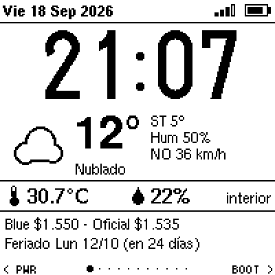
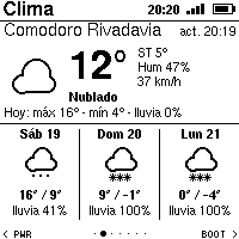
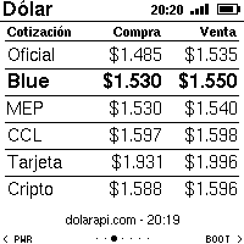
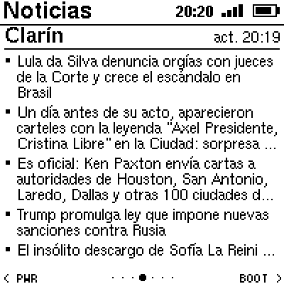
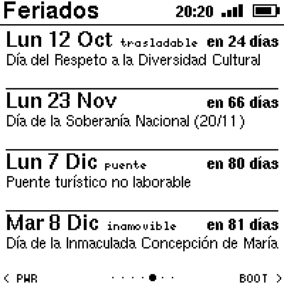
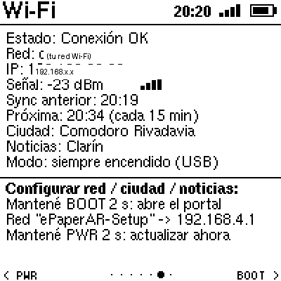
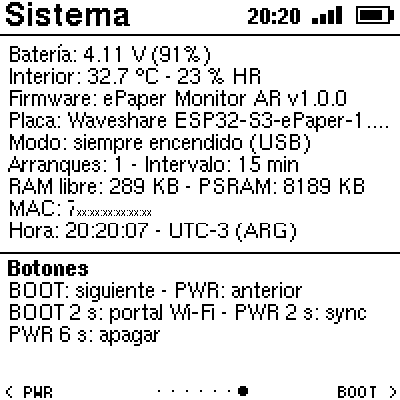

# ePaper Monitor AR

Firmware para la placa **Waveshare ESP32-S3-ePaper-1.54 (V2)**: un monitor de escritorio
argentino en tinta electrónica con **hora sincronizada por NTP (Argentina)**, **clima de tu
ciudad (ubicación automática)**, **dólar** (oficial, blue, MEP, CCL, tarjeta, cripto),
**noticias**, **feriados**, y **temperatura/humedad interior**. Navegación con los dos botones
de la placa al estilo M5StickC, portal Wi-Fi con QR y modo de bajo consumo para batería.

| Reloj | Clima | Dólar | Noticias |
|---|---|---|---|
|  |  |  |  |

| Feriados | Wi-Fi | Sistema |
|---|---|---|
|  |  |  |

*(capturas reales tomadas del framebuffer de la placa con `tools/fbdump.py`)*

Inspirado en [VolosR/waveshareEinkMonitor](https://github.com/VolosR/waveshareEinkMonitor)
(reloj + sensor SHTC3 con deep-sleep), reescrito desde cero con Wi-Fi, datos en línea,
7 secciones y navegación por botones.

---

## Características

- **Hora argentina** (UTC-3) sincronizada por NTP y guardada en el RTC PCF85063 de la placa:
  sigue en hora sin Wi-Fi y tras reinicios.
- **Ubicación automática**: al conectarse se geolocaliza por la IP pública de la red Wi-Fi
  (precisión a nivel ciudad). También se puede fijar una ciudad a mano.
- **Clima** actual + pronóstico de 3 días (Open-Meteo): temperatura, sensación térmica,
  humedad, viento, máx/mín, probabilidad de lluvia e íconos.
- **Dólar** (dolarapi.com): oficial, blue, MEP, CCL, tarjeta y cripto, compra/venta.
- **Noticias**: titulares por RSS de Clarín, Ámbito, Perfil, BBC Mundo o La Nación
  (parser incremental: no carga el XML completo en RAM).
- **Feriados** argentinos (argentinadatos.com): los próximos 4 con cuenta regresiva y tipo
  (inamovible / trasladable / puente).
- **Interior**: temperatura y humedad del sensor SHTC3 integrado; **batería** con porcentaje.
- **Portal de configuración Wi-Fi** (WiFiManager) con **QR** en pantalla: red, ciudad,
  intervalo de actualización, fuente de noticias y modo de energía. Sin credenciales en el código.
- **Bajo consumo**: deep-sleep entre actualizaciones (despierta cada minuto para el reloj,
  cada 15 min para los datos). Con una PC conectada por USB queda "siempre encendido"
  automáticamente (así el puerto COM no desaparece).
- Tipografías con acentos (U8g2), íconos de clima dibujados por código, refresco parcial
  rápido y refresco completo periódico contra el ghosting.

## Hardware

| Componente | Detalle |
|---|---|
| Placa | Waveshare **ESP32-S3-ePaper-1.54 V2** (ESP32-S3-PICO-1-N8R8: 8 MB flash, 8 MB PSRAM octal) |
| Pantalla | 1.54" 200×200 B/N, controlador SSD1681 (GDEH0154D67) por SPI |
| RTC | NXP PCF85063A (I2C 0x51) |
| Sensor | Sensirion SHTC3 temperatura/humedad (I2C 0x70) |
| Botones | BOOT (GPIO0) y PWR (GPIO18), ambos despiertan del deep-sleep |
| Batería | Li-ion por conector JST; medición en GPIO4 (divisor ×2) |
| USB | USB-C con USB-Serial/JTAG nativo del ESP32-S3 (VID 303A / PID 1001) |

Mapa de pines completo en [`include/config.h`](include/config.h) y en
[`docs/hardware.md`](docs/hardware.md). La V1 de la placa (PSRAM quad) y la variante
*Touch* comparten los mismos pines; el firmware sólo fue probado en la V2.

## Botones (navegación estilo M5StickC)

| Acción | Efecto |
|---|---|
| **BOOT** corto | sección siguiente → |
| **PWR** corto | sección anterior ← |
| **BOOT** 2 s | abre el **portal Wi-Fi** (el LED se enciende al llegar a 2 s) |
| **PWR** 2 s | **sincronizar ahora** (hora, clima, dólar, noticias, feriados) |
| **PWR** 6 s | **apagar** (a batería corta la alimentación; con USB queda dormida hasta apretar PWR) |

Secciones, en orden: Reloj · Clima · Dólar · Noticias · Feriados · Wi-Fi · Sistema.
Los puntos del pie de página indican la sección actual.

## Instalación

### Opción A — firmware precompilado

En [`firmware/`](firmware/) hay una imagen única (bootloader + particiones + aplicación) lista
para grabar en la dirección `0x0`. Con [esptool](https://docs.espressif.com/projects/esptool/)
instalado (`pip install esptool`):

```bash
esptool --chip esp32s3 --port COM4 --baud 460800 write-flash 0x0 firmware/epaper-monitor-ar-v1.0.0-merged.bin
```

(Reemplazá `COM4` por el puerto de tu placa. En Linux/macOS suele ser `/dev/ttyACM0`.)

### Opción B — compilar con PlatformIO

```bash
pio run -t upload          # compila y graba (puerto configurado en platformio.ini)
pio device monitor         # consola serie a 115200
```

Requiere PlatformIO con la plataforma `espressif32@6.13.0` (Arduino core 2.0.17); las
librerías (GxEPD2, U8g2_for_Adafruit_GFX, WiFiManager, ArduinoJson, QRCode) se instalan solas.

> Si la placa está en deep-sleep, el puerto COM sólo aparece ~1,5 s cada minuto. Para grabar:
> mantené **BOOT** 2 s (abre el portal y queda despierta 5 min) o conectala a la PC y
> reiniciala (con host USB detectado no duerme). Ver [`docs/desarrollo.md`](docs/desarrollo.md).

## Primer uso: configurar el Wi-Fi

1. Al encender sin red configurada, la pantalla muestra un **QR** y las instrucciones.
2. Escaneá el QR con el celular (o conectate a la red **`ePaperAR-Setup`**) y abrí
   `http://192.168.4.1`.
3. Elegí tu red Wi-Fi, ingresá la clave y guardá. Opcionalmente ajustá:
   - **Ciudad**: `auto` (geolocalización por la conexión) o el nombre de una ciudad argentina.
   - **Intervalo** de actualización de datos: 5–120 min (por defecto 15).
   - **Noticias**: `clarin`, `ambito`, `perfil`, `bbc` o `lanacion`.
   - **Siempre encendido**: desactiva el deep-sleep aunque no haya PC conectada.
4. La placa sincroniza la hora, se geolocaliza y descarga todos los datos.

Para volver al portal en cualquier momento: **BOOT** 2 s. El portal se cierra solo a los 5 min.

## Modos de energía

| Situación | Comportamiento |
|---|---|
| **Batería** (o cargador sin PC) | Deep-sleep. Despierta cada minuto para actualizar el reloj (refresco parcial, ~1 s) y cada *intervalo* para sincronizar por Wi-Fi (~10–15 s). Botones despiertan al instante. |
| **PC por USB** | Detecta el host (paquetes SOF) y queda **siempre encendido**: puerto serie disponible, botones por polling y Wi-Fi apagado entre sincronizaciones para calentar menos el sensor. Si se desconecta la PC (10 s sin SOF), pasa a deep-sleep solo. |
| **"Siempre encendido"** (portal) | Igual al modo USB, sin importar la alimentación. |

Nota: en modo siempre encendido el SHTC3 puede leer unos grados de más por el calor de la
propia placa; en deep-sleep la lectura es más fiel.

## Fuentes de datos (todas gratuitas, sin API key)

| Dato | Servicio |
|---|---|
| Hora | `ar.pool.ntp.org`, `south-america.pool.ntp.org`, `pool.ntp.org` |
| Ubicación (ciudad `auto`) | [ip-api.com](http://ip-api.com) (HTTP) con respaldo en [ipwho.is](https://ipwho.is) |
| Ciudad por nombre | [Open-Meteo Geocoding](https://open-meteo.com/en/docs/geocoding-api) |
| Clima | [Open-Meteo Forecast](https://open-meteo.com/) |
| Dólar | [DolarApi](https://dolarapi.com/) |
| Feriados | [ArgentinaDatos](https://argentinadatos.com/) |
| Noticias | RSS públicos de cada medio |

Privacidad y seguridad: las conexiones HTTPS se hacen **sin validar certificados**
(`setInsecure()`), suficiente para datos públicos; la geolocalización envía sólo la IP pública
(la del router) al servicio. No se guarda ninguna credencial en el repositorio: el Wi-Fi se
configura en la placa y queda en su NVS.

## Estructura del código

```
include/config.h      pines, constantes, zona horaria, valores por defecto
include/appdata.h     modelo de datos (config, clima, dólar, noticias, feriados, estado)
src/main.cpp          arranque, deep-sleep, botones, comandos por serie, ciclo principal
src/board.*           rails de energía, LED, batería, botones, deep-sleep, detección de USB
src/net.*             WiFiManager (portal), NTP, HTTP, geolocalización y descarga de datos
src/ui.*              render de las 7 secciones (GxEPD2 + U8g2), íconos, QR, volcado de pantalla
src/rtc_pcf85063.*    driver mínimo del RTC
src/shtc3.*           driver mínimo del sensor
tools/fbdump.py       captura la pantalla por USB y la guarda como PNG
tools/flash_catch.py  graba el firmware "cazando" la ventana en que la placa despierta
firmware/             imagen precompilada lista para grabar
docs/                 hardware, desarrollo e imágenes
```

## Desarrollo y depuración

Con la placa conectada por USB (modo siempre encendido) se aceptan comandos por el puerto
serie (115200): `n`/`p` cambiar de sección, `s` sincronizar, `f` refresco completo, `w` portal
Wi-Fi, `d` volcar la pantalla actual, `a` volcar las 7 secciones. El script
`python tools/fbdump.py COM4 a` genera los PNG de cada sección en `tools/out/` (así se hicieron
las capturas de este README). Más detalles en [`docs/desarrollo.md`](docs/desarrollo.md).

## Créditos

- [Waveshare](https://www.waveshare.com/wiki/ESP32-S3-ePaper-1.54) por la placa y los ejemplos
  (de ahí salen el mapa de pines y la lógica de energía).
- [VolosR](https://github.com/VolosR/waveshareEinkMonitor) por la inspiración inicial.
- Librerías: [GxEPD2](https://github.com/ZinggJM/GxEPD2), [U8g2_for_Adafruit_GFX](https://github.com/olikraus/U8g2_for_Adafruit_GFX),
  [WiFiManager](https://github.com/tzapu/WiFiManager), [ArduinoJson](https://arduinojson.org/),
  [QRCode](https://github.com/ricmoo/QRCode), Adafruit GFX.

## Licencia

MIT — ver [`LICENSE`](LICENSE).
